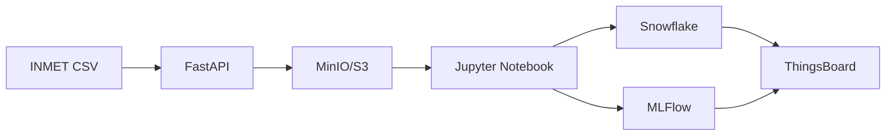

# 🍇 AVD - Pipeline de BI Climático para Viticultura

## 📋 Índice

1. [Introdução e Objetivo](#1-introdução-e-objetivo)
2. [Membros do Projeto](#2-membros-do-projeto)
3. [Arquitetura do Pipeline](#3-arquitetura-do-pipeline)
4. [Estrutura do Repositório](#4-estrutura-do-repositório)
5. [Tecnologias Utilizadas](#5-tecnologias-utilizadas)
6. [Instruções de Execução](#6-instruções-de-execução)
7. [Notebooks do Projeto](#7-notebooks-do-projeto)
8. [Scripts Auxiliares](#8-scripts-auxiliares)
9. [Troubleshooting](#9-troubleshooting)
10. [Resultados e Conclusões](#10-resultados-e-conclusões)

---

## 1. Introdução e Objetivo

Este projeto implementa um pipeline de Business Intelligence (BI) para análise e visualização de dados meteorológicos do **INMET (Instituto Nacional de Meteorologia)**, focando no estado de **Pernambuco**, com ênfase no **Vale do São Francisco**.

### Objetivo Central

Aplicar técnicas de **Agrupamento (Clustering) K-Means** para identificar **Padrões Climáticos Chave** durante fases críticas da videira, como a floração e a maturação, utilizando dados agregados de temperatura, umidade, radiação solar, vento, precipitação e pressão atmosférica. O resultado deste agrupamento é visualizado em dashboards interativos no **ThingsBoard**.

### Dados Processados

- **Período:** 2020 a 2024
- **Estações:** Petrolina (A307) e Garanhuns (A322)
- **Frequência:** Dados horários
- **Variáveis:** Temperatura, Umidade, Radiação, Vento, Precipitação, Pressão

## 2. Membros do Projeto

| Nome | Usuário |
| :--- | :--- |
| Lisa Matubara | `lm` |
| Luziane Santos | `lps` |
| Maria Júlia Peixoto | `mjpo` |
| Matheus Velame | `mvp2` |
| Paulo Rago | `prcr` |
| Thaís Aguiar | `thcba` |

* **Disciplina:** Análise e Visualização de Dados - 2025.2
* **Instituição:** CESAR School

## 3. Arquitetura do Pipeline

A solução é baseada em contêineres **Docker** e orquestrada via **Docker Compose**, abrangendo as seguintes camadas:

| Serviço | Função Principal | Porta | URL de Acesso |
| :--- | :--- | :--- | :--- |
| **JupyterLab** | Ambiente de análise, tratamento de dados e modelagem | `8888` | `http://localhost:8888` |
| **FastAPI** | Interface de ingestão dos dados brutos do INMET e integração com MinIO/S3 | `8000` | `http://localhost:8000` |
| **MinIO/S3** | Armazenamento de dados brutos e modelos | `9000` (API)<br>`9001` (Console) | `http://localhost:9001` |
| **Snowflake** | Estruturação de dados tratados (banco de dados cloud) | - | Configurado externamente |
| **MLFlow** | Registro e versionamento do modelo de K-Means e artefatos | `5000` | `http://localhost:5000` |
| **ThingsBoard** | Plataforma IoT para visualização de dados e dashboards | `8090` | `http://localhost:8090` |

### Fluxo Geral do Pipeline



1. **Ingestão:** Os dados brutos do INMET são ingeridos via FastAPI e salvos no MinIO/S3.
2. **Tratamento:** O Jupyter Notebook processa os dados brutos, aplica limpeza e interpolação temporal.
3. **Estruturação:** Os dados tratados são carregados no Snowflake para armazenamento estruturado.
4. **Modelagem:** O notebook aplica K-Means para identificar padrões climáticos e registra o modelo no MLFlow.
5. **Visualização:** O ThingsBoard consome os resultados do agrupamento para gerar dashboards interativos.

## 4. Estrutura do Repositório

```
AVD-projeto/
├── data/
│   ├── raw/                    # Dados brutos do INMET (CSV)
│   │   ├── 2020/
│   │   ├── 2021/
│   │   ├── 2022/
│   │   ├── 2023/
│   │   └── 2024/
│   └── processed/               # Dados tratados (CSV)
│       ├── petrolina_*_tratado.csv
│       └── garanhuns_*_tratado.csv
├── notebooks/
│   ├── 01_carregar_dados.ipynb          # Notebook exploratório
│   ├── 01_tratamento_dados_inmet.ipynb  # Processamento completo e carga no Snowflake
│   └── 02_Modelagem_KMeans.ipynb         # Modelagem e clustering
├── fastapi/
│   ├── main.py                  # API de ingestão
│   ├── requirements.txt
│   └── Dockerfile
├── scripts/
│   ├── etl_minio_to_snowflake.py    # ETL MinIO → Snowflake
│   ├── send_inmet_to_tb.py           # Envio de dados para ThingsBoard
│   └── test_pipeline.py              # Testes do pipeline
├── mlflow/
│   └── artifacts/                # Artefatos dos modelos
├── minio/
│   └── data/                     # Dados armazenados no MinIO
├── thingsboard/
│   ├── data/                     # Banco de dados do ThingsBoard
│   └── logs/                     # Logs do ThingsBoard
├── docker-compose.yml            # Orquestração dos serviços
├── Dockerfile.jupyter            # Dockerfile do Jupyter
└── README.md                     # Este arquivo
```

## 5. Tecnologias Utilizadas

### Backend e Infraestrutura
- **Docker & Docker Compose** - Containerização e orquestração
- **FastAPI** - API REST para ingestão de dados
- **MinIO** - Armazenamento de objetos compatível com S3
- **Snowflake** - Data warehouse cloud
- **PostgreSQL** - Banco de dados do ThingsBoard

### Análise de Dados e Machine Learning
- **Python 3.11** - Linguagem principal
- **Pandas** - Manipulação e análise de dados
- **NumPy** - Computação numérica
- **Scikit-learn** - Machine Learning (K-Means)
- **JupyterLab** - Ambiente de desenvolvimento interativo

### MLOps e Versionamento
- **MLFlow** - Gerenciamento do ciclo de vida de modelos
- **Git** - Controle de versão

### Visualização e IoT
- **ThingsBoard** - Plataforma IoT para visualização
- **Matplotlib** - Visualizações estáticas
- **Seaborn** - Visualizações estatísticas (opcional)

## 6. Instruções de Execução

### 6.1. Pré-requisitos

- **Docker** (versão 20.10 ou superior)
- **Docker Compose** (versão 2.0 ou superior)
- **Git** (para clonar o repositório)
- **Conexão estável com a internet** (para download de imagens Docker)
- **8GB de RAM** (recomendado)
- **10GB de espaço em disco** (para dados e imagens)

### 6.2. Clonagem do Repositório

```bash
git clone <git@github.com:aguiarth/AVD-projeto.git>
cd AVD-projeto
```

### 6.3. Subir a Infraestrutura

1. **Construir as imagens e iniciar os serviços:**

```bash
docker-compose up -d --build
```

2. **Verificar se todos os serviços estão rodando:**

```bash
docker-compose ps
```

Você deve ver todos os serviços com status `Up`:
- `jupyter-uva`
- `thingsboard`
- `fastapi-clima`
- `minio`
- `mlflow_server`

3. **Acessar os serviços:**

- **JupyterLab:** `http://localhost:8888` (sem token)
- **FastAPI:** `http://localhost:8000`
- **MinIO Console:** `http://localhost:9001` (usuário: `admin`, senha: `admin12345`)
- **MLFlow:** `http://localhost:5000`
- **ThingsBoard:** `http://localhost:8090` (usuário: `tenant@thingsboard.org`, senha: `tenant`)

### 6.4. Execução do Pipeline

#### Passo 1: Processamento dos Dados

1. **Acesse o JupyterLab:** `http://localhost:8888`

2. **Execute o notebook `01_tratamento_dados_inmet.ipynb`:**
   - Este notebook processa todos os arquivos CSV do INMET (2020-2024)
   - Aplica limpeza, interpolação temporal e tratamento de valores faltantes
   - Salva os dados tratados em `/data/processed/`
   - **Carrega os dados diretamente no Snowflake**

   **Variáveis processadas:**
   - Temperatura do ar (°C)
   - Umidade relativa (%)
   - Radiação global (kJ/m²) - quando disponível
   - Velocidade do vento (m/s)
   - Precipitação (mm)
   - Pressão atmosférica (mB)

3. **Para exploração rápida, use o notebook `01_carregar_dados.ipynb`:**
   - Permite visualizar e explorar um arquivo específico
   - Usa a mesma função de processamento do notebook principal

#### Passo 2: Modelagem K-Means

1. **Execute o notebook `02_Modelagem_KMeans.ipynb`:**
   - Carrega os dados tratados (de `/data/processed/` ou Snowflake)
   - Agrega dados por semana
   - Trata outliers
   - Aplica normalização (StandardScaler)
   - Treina o modelo K-Means
   - Avalia o modelo (silhouette score)
   - Registra o modelo no MLFlow

2. **Visualizar o modelo no MLFlow:**
   - Acesse `http://localhost:5000`
   - Navegue até o experimento "K-Means Clustering"
   - Visualize métricas, parâmetros e artefatos

#### Passo 3: Visualização no ThingsBoard

1. **Acesse o ThingsBoard:** `http://localhost:8090`
   - Credenciais padrão: `tenant@thingsboard.org` / `tenant`

2. **Configure dispositivos e dashboards:**
   - Crie dispositivos para cada estação (Petrolina, Garanhuns)
   - Use o script `scripts/send_inmet_to_tb.py` para enviar dados
   - Crie dashboards para visualizar os clusters identificados

## 7. Notebooks do Projeto

### `01_carregar_dados.ipynb`

**Propósito:** Notebook exploratório para visualização e análise rápida de dados.

**Funcionalidades:**
- Lista arquivos CSV disponíveis
- Processa um arquivo específico usando a função `processar_inmet()`
- Exibe estatísticas descritivas
- Verifica valores faltantes
- Visualiza amostras dos dados

**Quando usar:** Para exploração inicial dos dados ou análise de um arquivo específico.

### `01_tratamento_dados_inmet.ipynb`

**Propósito:** Processamento completo de todos os arquivos do INMET e carga no Snowflake.

**Funcionalidades:**
- Processa todos os arquivos CSV (2020-2024, Petrolina e Garanhuns)
- Aplica função `processar_inmet()` padronizada
- Interpola valores faltantes usando método temporal
- Remove colunas 100% vazias (ex: radiação quando ausente)
- Cria features auxiliares (hora_num, mes)
- Salva dados tratados em CSV
- **Carrega dados no Snowflake**

**Tratamento aplicado:**
- Conversão de vírgula para ponto decimal
- Padronização de formato de hora
- Criação de índice datetime
- Interpolação temporal de valores faltantes
- Preenchimento de bordas (ffill/bfill)

**Quando usar:** Para processar todos os dados e preparar para modelagem.

### `02_Modelagem_KMeans.ipynb`

**Propósito:** Modelagem de clustering para identificar padrões climáticos.

**Funcionalidades:**
- Carrega dados tratados
- Agregação semanal dos dados horários
- Tratamento de outliers
- Normalização com StandardScaler
- Treinamento de K-Means
- Avaliação com silhouette score
- Visualização dos clusters
- Registro no MLFlow

**Quando usar:** Após o processamento dos dados, para identificar padrões climáticos.

## 8. Scripts Auxiliares

### `scripts/etl_minio_to_snowflake.py`

Script para extrair dados do MinIO e carregar no Snowflake.

**Uso:**
```bash
python scripts/etl_minio_to_snowflake.py
```

### `scripts/send_inmet_to_tb.py`

Script para enviar dados processados para o ThingsBoard.

**Uso:**
```bash
python scripts/send_inmet_to_tb.py
```

### `scripts/test_pipeline.py`

Script de testes para validar o pipeline completo.

**Uso:**
```bash
python scripts/test_pipeline.py
```

## 9. Troubleshooting

### Problema: Serviços não iniciam

**Solução:**
```bash
# Verificar logs
docker-compose logs

# Reiniciar serviços
docker-compose restart

# Reconstruir imagens
docker-compose up -d --build --force-recreate
```

### Problema: Porta já em uso

**Solução:**
- Verifique se outra aplicação está usando a porta
- Altere a porta no `docker-compose.yml` se necessário
- Use `docker-compose down` antes de subir novamente

### Problema: Erro ao processar dados

**Solução:**
- Verifique se os arquivos CSV estão em `/data/raw/` com a estrutura correta
- Confirme que o encoding é `latin1`
- Verifique os logs do Jupyter: `docker-compose logs jupyterlab`

### Problema: Snowflake não conecta

**Solução:**
- Verifique as credenciais no notebook `01_tratamento_dados_inmet.ipynb`
- Confirme que o Snowflake está acessível
- Verifique a configuração de rede/firewall

### Problema: MLFlow não salva modelos

**Solução:**
- Verifique se o volume `./mlflow` está montado corretamente
- Confirme permissões de escrita no diretório
- Verifique logs: `docker-compose logs mlflow`

### Comandos Úteis

```bash
# Parar todos os serviços
docker-compose down

# Parar e remover volumes
docker-compose down -v

# Ver logs de um serviço específico
docker-compose logs -f jupyterlab

# Executar comando em um container
docker-compose exec jupyterlab bash

# Limpar recursos não utilizados
docker system prune -a
```

## 10. Resultados e Conclusões

### Dados Processados

- **Total de registros:** ~87.000 registros horários (por ano)
- **Período:** 2020-2024
- **Estações:** 2 (Petrolina e Garanhuns)
- **Variáveis climáticas:** 6 principais

### Modelo K-Means

- **Método:** Clustering não-supervisionado
- **Features:** Agregações semanais de variáveis climáticas
- **Avaliação:** Silhouette score
- **Versionamento:** MLFlow

### Visualização

- **Plataforma:** ThingsBoard
- **Dashboards:** Padrões climáticos por cluster
- **Interatividade:** Filtros por período, estação e variável

### Relatório Técnico

O relatório final em PDF, contendo a arquitetura, metodologia, resultados e conclusões, será enviado junto da entrega.

## 📚 Referências

- [INMET - Instituto Nacional de Meteorologia](https://portal.inmet.gov.br/)
- [ThingsBoard - Documentação](https://thingsboard.io/docs/)
- [MLFlow - Documentação](https://www.mlflow.org/docs/latest/index.html)
- [Snowflake - Documentação](https://docs.snowflake.com/)
- [Scikit-learn K-Means](https://scikit-learn.org/stable/modules/clustering.html#k-means)

## 📝 Licença

Este projeto é desenvolvido para fins acadêmicos no contexto da disciplina de Análise e Visualização de Dados da CESAR School.

## 🤝 Equipe

Este é um projeto acadêmico desenvolvido pela equipe [Cobalto](#2-membros-do-projeto).
